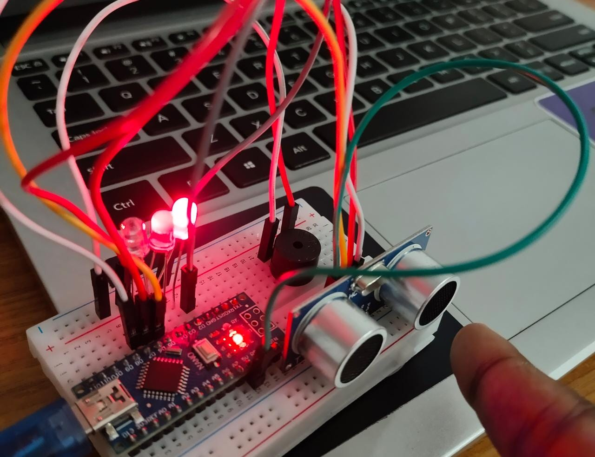

# Car-Backlight-Siren-using-Arduino-Nano
 
Using an ultrasonic senor for calculating the distance from the obstacle
 
 
Assuming the car as the nano board while to approching the wall
 
 

- When the board is more than a meter away
  - Green light🟢 shows up
  - No buzzer🔇
  
- When the board is less then 1meter and more then 50cm from the wall
  - Yellow light🟡 shows up
  - Warning buzzer🔉
  
- When the board is less than 50cm
  - red light🔴 shows up
  - danger buzzer sounds🔊
